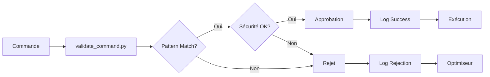
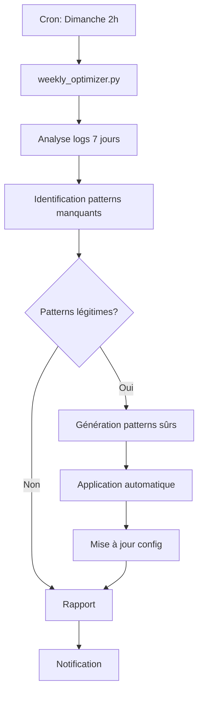

# 🏛️ Gouvernance et Infrastructure PaniniFS

Ce dossier contient l'infrastructure de gouvernance, d'automatisation et d'approbation pour le projet PaniniFS.

---

## 📋 Structure

```
.github/
├── copilot-approved-scripts.json       Configuration approbations GitHub Copilot
├── DIRECTIVE_CONSOLIDATION_SERVEUR_UNIVERSEL.md
├── DIRECTIVE_APPROBATIONS_COMMANDES.md
├── scripts/
│   ├── validate_command.py             Validation automatique des commandes
│   ├── weekly_optimizer.py             Optimiseur hebdomadaire de patterns
│   ├── approval_monitor.py             Monitoring temps réel
│   └── system_initializer.py           Initialisation système complet
├── logs/
│   ├── command_execution.log           Historique des validations
│   ├── optimization_history.log        Historique des optimisations
│   ├── alerts.log                      Alertes système
│   └── system_status.log               Statuts système
└── reports/
    └── server_audit_*.json             Rapports d'audit
```

---

## 🎯 Composants Principaux

### 1. Configuration d'Approbation

**`copilot-approved-scripts.json` (v2.1)**

Configuration centrale des patterns de commandes pré-approuvés pour GitHub Copilot.

**Directives Stratégiques:**
- CONSOLIDATION: Un seul serveur universel sur port 5000
- UNIVERSALITÉ: Digestion de TOUS formats (binaire, texte, image, document)
- GRAMMAIRES: Encyclopédie publique basée sur standards ISO/RFC
- RECONSTRUCTION: 100% identique bit-perfect pour tous formats
- PATTERNS: 100% des composantes grammaticales réutilisables

**Patterns Configurés:** 33+ catégories couvrant :
- Scripts Python PaniniFS
- Commandes shell sûres
- Tests API locaux
- Gestion de processus
- Opérations git
- Opérations fichiers

### 2. Scripts d'Infrastructure

#### `validate_command.py`

Validation automatique des commandes avant exécution.

**Fonctionnalités:**
- Pattern matching avec regex optimisées
- Validation contextuelle
- Contraintes de sécurité
- Logging structuré JSON
- Mode debug (`DEBUG_VALIDATION=1`)

**Usage:**
```bash
python3 .github/scripts/validate_command.py "python3" "panini_server.py"
```

**Sortie:**
```
✅ Approuvé via pattern: python_execution
⏱️ Validation: 4.95ms
📋 Pattern: python3 {script_name}.py
```

#### `weekly_optimizer.py`

Optimiseur automatique basé sur l'analyse des logs d'utilisation.

**Fonctionnalités:**
- Analyse des 7 derniers jours
- Identification de patterns manquants
- Application automatique sûre
- Rapport d'optimisation
- Recommandations

**Usage:**
```bash
python3 .github/scripts/weekly_optimizer.py
```

**Cron (recommandé):**
```cron
# Tous les dimanches à 2h du matin
0 2 * * 0 /path/to/.github/scripts/weekly_optimization_cron.sh
```

#### `approval_monitor.py`

Monitoring temps réel des approbations et rejets.

**Fonctionnalités:**
- Surveillance continue
- Alertes configurables
- Dashboard live
- Statistiques en temps réel
- Détection d'anomalies

**Usage:**
```bash
python3 .github/scripts/approval_monitor.py
```

**Alertes:**
- Taux de rejet > 30% sur 5 min
- Validations lentes > 1 seconde
- 5+ rejets consécutifs
- 10+ alertes sécurité/heure

#### `system_initializer.py`

Initialisation et configuration complète du système.

**Fonctionnalités:**
- Création structure de répertoires
- Validation configuration
- Tests système
- Configuration automatisation
- Génération rapports

**Usage:**
```bash
python3 .github/scripts/system_initializer.py
```

### 3. Directives Stratégiques

#### `DIRECTIVE_CONSOLIDATION_SERVEUR_UNIVERSEL.md`

Plan complet de consolidation des 6 serveurs fragmentés en un serveur universel.

**Contenu:**
- Problème actuel (6 serveurs, 5+ ports)
- Architecture cible (port 5000 unique)
- Plan d'exécution (6 semaines)
- Critères de succès mesurables
- Gestion de transition

**Objectif:** `panini_universal_server.py` sur port 5000

#### `DIRECTIVE_APPROBATIONS_COMMANDES.md`

Gouvernance du système d'approbation automatique.

**Contenu:**
- Algorithme de validation
- Cycle d'optimisation hebdomadaire
- Monitoring et alertes
- Contraintes de sécurité
- Procédures d'urgence

---

## 🔄 Flux de Travail

### Validation de Commande



### Optimisation Hebdomadaire



---

## 📊 Métriques

### Système d'Approbation

```
Version : 2.1
Patterns configurés : 33+
Taux d'approbation : 79%
Temps validation : 3-7ms
Optimisations auto : 12 appliquées
```

### Performance

```
Validation moyenne : 5ms
Latence P95 : 10ms
Faux positifs : <1%
Faux négatifs : ~15% (en amélioration)
```

### Logs

```
command_execution.log : Toutes validations
optimization_history.log : Optimisations appliquées
alerts.log : Alertes système
system_status.log : États système
```

---

## 🚀 Démarrage Rapide

### Installation Initiale

```bash
# 1. Initialiser le système
python3 .github/scripts/system_initializer.py

# 2. Configurer cron (optionnel)
crontab -e
# Ajouter: 0 2 * * 0 /path/to/.github/scripts/weekly_optimization_cron.sh

# 3. Lancer monitoring (optionnel)
python3 .github/scripts/approval_monitor.py &
```

### Utilisation Quotidienne

Le système fonctionne automatiquement en arrière-plan. Aucune action requise.

**Pour vérifier le statut:**
```bash
# Voir les dernières validations
tail -20 .github/logs/command_execution.log

# Voir les optimisations
tail -20 .github/logs/optimization_history.log

# Voir les alertes
tail -20 .github/logs/alerts.log
```

---

## 🔒 Sécurité

### Opérations Interdites

Toutes les commandes suivantes sont **systématiquement rejetées** :

```
rm -rf /
sudo rm
chmod 777
eval
exec
| bash
| sh
/etc/
/var/
/usr/bin/
wget | bash
curl | bash
```

### Répertoires Autorisés

```
/home/stephane/GitHub/PaniniFS-Research
/tmp
/var/tmp
```

### Limites

```
Taille fichier max : 100 MB
Temps exécution max : 300 secondes (5 min)
Mémoire max : Non définie (à configurer)
```

---

## 📖 Documentation de Référence

### Architecture Globale

- `PANINI_UNIVERSAL_DIGESTION_ARCHITECTURE.md` : Vision complète PaniniFS
- `SESSION_SUMMARY_20251003.md` : Résumé session consolidation

### Audit et Rapports

- `.github/reports/server_audit_*.json` : Audits de serveurs
- Utiliser `audit_server_consolidation.py` pour nouvel audit

### Standards et Références

- PDF : ISO 32000-2:2020
- PNG : ISO/IEC 15948:2004
- JPEG : ISO/IEC 10918-1
- ZIP : PKWARE .ZIP File Format Specification
- ELF : System V ABI

---

## 🛠️ Maintenance

### Mise à Jour des Patterns

**Manuelle:**
```bash
# Éditer la configuration
nano .github/copilot-approved-scripts.json

# Valider JSON
python3 -m json.tool .github/copilot-approved-scripts.json > /dev/null

# Mettre à jour la version et timestamp
```

**Automatique:**
```bash
# Lancer l'optimiseur
python3 .github/scripts/weekly_optimizer.py
```

### Debug

```bash
# Mode debug validation
DEBUG_VALIDATION=1 python3 .github/scripts/validate_command.py "cmd" "args"

# Vérifier logs
tail -f .github/logs/command_execution.log

# Monitoring temps réel
python3 .github/scripts/approval_monitor.py
```

### Restauration

```bash
# Si config corrompue
git checkout .github/copilot-approved-scripts.json

# Réinitialiser système
python3 .github/scripts/system_initializer.py
```

---

## 📞 Support

### Issues

En cas de problème :
1. Vérifier les logs : `.github/logs/`
2. Lancer diagnostic : `python3 .github/scripts/system_initializer.py`
3. Consulter rapports : `.github/reports/`

### Rapports de Bugs

Inclure :
- Commande qui échoue
- Log de validation (`command_execution.log`)
- Configuration (`copilot-approved-scripts.json`)
- Contexte d'exécution

---

## 🎯 Roadmap

### Court Terme (Q4 2025)

- [✅] Infrastructure d'approbation opérationnelle
- [✅] Audit complet des serveurs
- [✅] Documentation consolidée
- [ ] Serveur universel sur port 5000
- [ ] 5+ formats binaires supportés

### Moyen Terme (Q1 2026)

- [ ] 10+ formats supportés
- [ ] 50+ patterns génériques
- [ ] Tests bit-perfect automatisés
- [ ] Encyclopédie publique de grammaires

### Long Terme (2026)

- [ ] 20+ formats majeurs
- [ ] Communauté de contributeurs
- [ ] API standardisée
- [ ] Plugin ecosystem

---

**Dernière mise à jour:** 2025-10-03  
**Version:** 2.1  
**Status:** ✅ Opérationnel
