# 📊 PaniniFS IP Architecture - Diagrammes

## 1. Architecture Globale (Stack Complet)

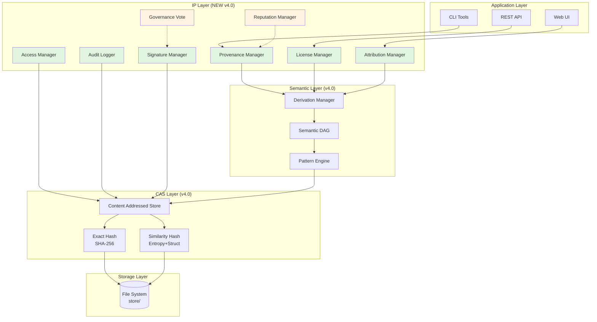

---

## 2. Provenance Chain Flow

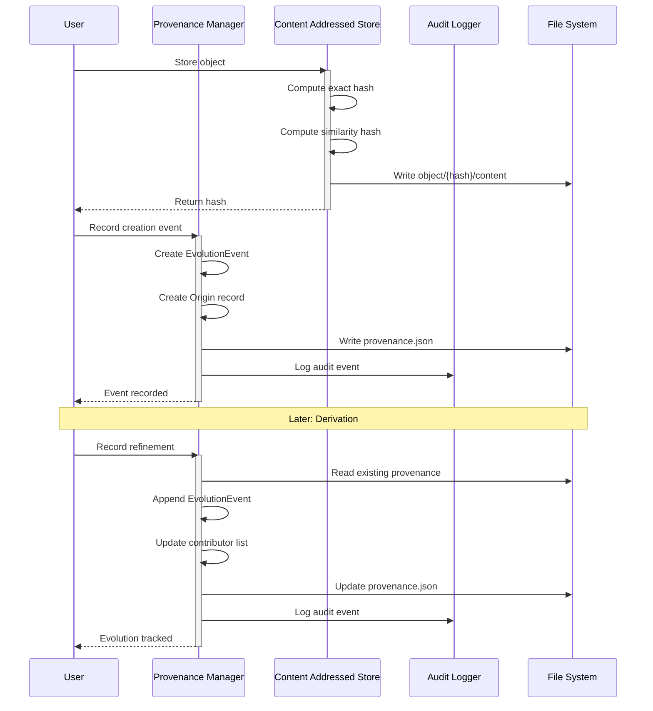

---

## 3. License Compatibility Checking

```mermaid
flowchart TD
    Start[User creates derived object] --> LoadParents[Load parent objects]
    LoadParents --> ExtractLicenses[Extract parent licenses]
    ExtractLicenses --> CheckCompat{All licenses<br/>compatible?}
    
    CheckCompat -->|Yes| ComputeEffective[Compute effective license]
    CheckCompat -->|No| Error[❌ Reject: Incompatible licenses]
    
    ComputeEffective --> ChooseMost[Choose most permissive]
    ChooseMost --> InheritConds[Inherit conditions]
    InheritConds --> StoreComposite[Store composite license]
    StoreComposite --> Success[✅ License applied]
    
    Error --> End[End]
    Success --> End
    
    style CheckCompat fill:#ffe6e6
    style Error fill:#ffcccc
    style Success fill:#ccffcc
```

---

## 4. Access Control Decision

```mermaid
flowchart TD
    Request[User requests access] --> LoadPolicy[Load AccessPolicy]
    LoadPolicy --> CheckVis{Visibility<br/>scope?}
    
    CheckVis -->|PUBLIC| AllowRead[✅ Allow read]
    CheckVis -->|UNLISTED| CheckHash{Has exact<br/>hash?}
    CheckVis -->|PRIVATE| CheckOwner{Is owner?}
    CheckVis -->|RESTRICTED| CheckACL{In ACL?}
    CheckVis -->|EMBARGOED| CheckDate{After embargo<br/>date?}
    
    CheckHash -->|Yes| AllowRead
    CheckHash -->|No| Deny[❌ Deny: Not found]
    
    CheckOwner -->|Yes| AllowFull[✅ Allow full access]
    CheckOwner -->|No| Deny
    
    CheckACL -->|Yes| CheckPerm{Has required<br/>permission?}
    CheckACL -->|No| Deny
    
    CheckPerm -->|Yes| AllowPerm[✅ Allow with permissions]
    CheckPerm -->|No| Deny
    
    CheckDate -->|Yes| AllowRead
    CheckDate -->|No| Deny
    
    AllowRead --> LogAccess[Log access event]
    AllowFull --> LogAccess
    AllowPerm --> LogAccess
    Deny --> LogDenied[Log denied event]
    
    LogAccess --> End[End]
    LogDenied --> End
    
    style AllowRead fill:#ccffcc
    style AllowFull fill:#ccffcc
    style AllowPerm fill:#ccffcc
    style Deny fill:#ffcccc
```

---

## 5. Signature Verification Flow

```mermaid
sequenceDiagram
    participant User
    participant SM as Signature Manager
    participant CAS as Content Addressed Store
    participant GPG as GPG Keyring
    participant Trust as Trust Network
    
    User->>SM: Verify signature for object
    activate SM
    
    SM->>CAS: Load object content
    CAS-->>SM: Object data
    
    SM->>SM: Compute canonical hash
    
    SM->>GPG: Verify signature
    activate GPG
    GPG->>GPG: Check signature validity
    GPG->>GPG: Check key expiration
    GPG->>GPG: Check key revocation
    GPG-->>SM: Verification result
    deactivate GPG
    
    alt Signature valid
        SM->>Trust: Get signer trust score
        Trust-->>SM: Trust score
        
        SM->>SM: Combine signature + trust
        SM-->>User: ✅ VALID (trust: 0.87)
    else Signature invalid
        SM-->>User: ❌ INVALID
    else Key expired
        SM-->>User: ⚠️ EXPIRED
    else Key revoked
        SM-->>User: ❌ REVOKED
    end
    
    deactivate SM
```

---

## 6. Storage Structure (Extended)

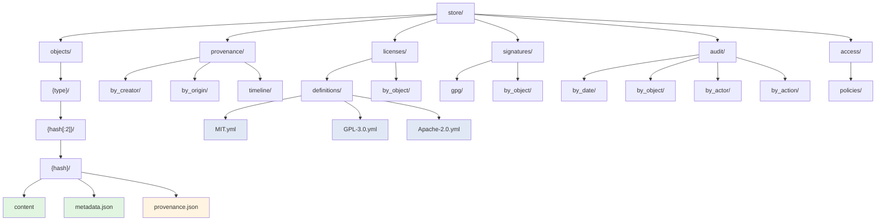

---

## 7. Reputation Calculation

```mermaid
flowchart LR
    subgraph "Input Metrics"
        OC[Objects Created]
        OM[Objects Maintained]
        RG[Reviews Given]
        RP[Reviews Received<br/>Positive]
        Citations[Citations]
        Usage[Usage in Grammars]
    end
    
    subgraph "Score Components"
        OC --> CS[Contribution Score<br/>0-25]
        OM --> CS
        
        RG --> QS[Quality Score<br/>0-25]
        RP --> QS
        
        Citations --> IS[Impact Score<br/>0-25]
        Usage --> IS
        
        Trust[Trust from<br/>Community] --> TS[Trust Score<br/>0-25]
    end
    
    subgraph "Final Score"
        CS --> Total[Total Reputation<br/>0-100]
        QS --> Total
        IS --> Total
        TS --> Total
    end
    
    Total --> Badge{Badge<br/>eligible?}
    Badge -->|80+| Trusted[🏆 Trusted]
    Badge -->|60+| Prolific[⭐ Prolific]
    Badge -->|40+| Contributor[✓ Contributor]
    
    style Total fill:#fff4e1
    style Trusted fill:#ccffcc
    style Prolific fill:#e1f5e1
    style Contributor fill:#f0f0f0
```

---

## 8. Governance Vote Flow

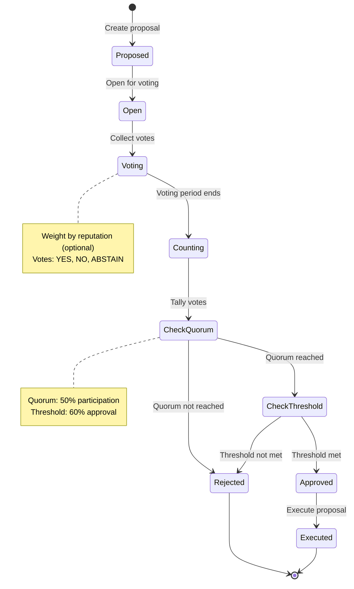

---

## 9. Object Lifecycle with IP

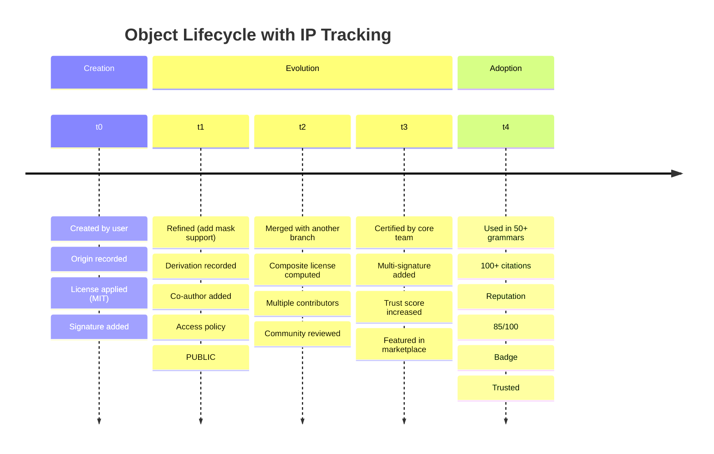

---

## 10. Multi-License Inheritance

```mermaid
graph TD
    subgraph "Source Objects"
        A[Object A<br/>License: MIT]
        B[Object B<br/>License: Apache-2.0]
        C[Object C<br/>License: BSD-3]
    end
    
    subgraph "Compatibility Matrix"
        A -.->|Compatible| Matrix{License<br/>Compatibility<br/>Checker}
        B -.->|Compatible| Matrix
        C -.->|Compatible| Matrix
    end
    
    subgraph "Derived Object"
        Matrix -->|All compatible| Derived[Object D<br/>Composite License]
        Derived --> Effective[Effective: MIT<br/>Most permissive]
        Derived --> Inherited[Inherited:<br/>- MIT from A<br/>- Apache-2.0 from B<br/>- BSD-3 from C]
        Derived --> Attribution[Attribution:<br/>Must credit A, B, C]
    end
    
    Matrix -.->|Incompatible| Error[❌ Cannot derive<br/>GPL-3.0 + MIT conflict]
    
    style Matrix fill:#ffe6e6
    style Derived fill:#ccffcc
    style Error fill:#ffcccc
```

---

## 11. Audit Trail Example

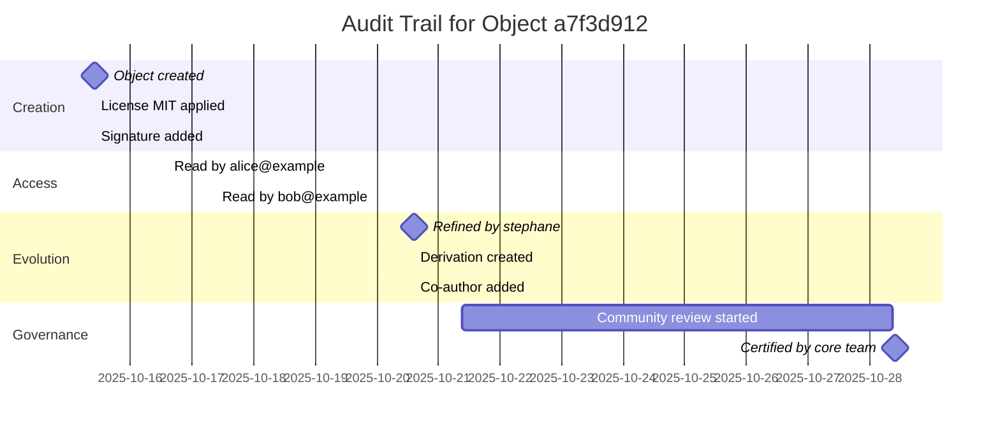

---

## 12. Trust Network

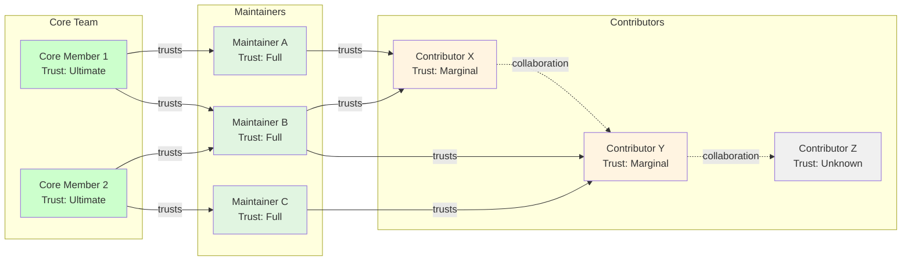

---

**Generated:** 2025-10-28  
**Format:** Mermaid diagrams for IP architecture visualization  
**License:** MIT
