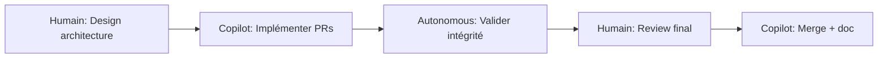
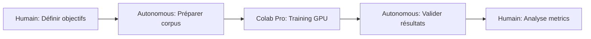
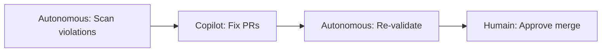

# 🎭 Guide Collaboration Multi-Agent

**Date** : 2025-10-01  
**Système** : Orchestration Humain + GitHub Copilot + Colab Pro + Autonomous Wrapper

---

## 🎯 Objectif

Gérer efficacement l'assignation des tâches entre plusieurs agents (humains et IA) avec :
- ✅ Assignation **optimale** automatique
- ✅ Tracking **qui fait quoi** en temps réel
- ✅ Détection **conflits** et handoff
- ✅ Métriques **performance** par agent

---

## 🤖 Agents Disponibles

### 1. **Humain (Vous - Stéphane)**

**Capacités** :
- Architecture système
- Recherche fondamentale
- Code review stratégique
- Décisions critiques

**Contraintes** :
- 1 tâche à la fois
- Disponibilité limitée (heures ouvrables)
- Pas de tâches répétitives

**Quand l'utiliser** :
- ✅ Décisions architecture
- ✅ Research direction
- ✅ Validation finale critique
- ❌ Tâches automatisables

### 2. **GitHub Copilot SWE Agent**

**Capacités** :
- Code review automatique
- Refactoring code
- Documentation génération
- Validation tests

**Contraintes** :
- Besoin mention `@copilot` dans issues
- 4 tâches concurrentes max
- Limité aux PRs/Issues GitHub

**Quand l'utiliser** :
- ✅ Refactoring massif
- ✅ Tests unitaires génération
- ✅ Documentation API
- ✅ Code review PRs
- ❌ Tâches GPU-intensives

**Activation** :
```markdown
@copilot Refactoriser les validateurs PaniniFS pour retourner bool au lieu de Dict
```

### 3. **Google Colab Pro (GPU)**

**Capacités** :
- ML training (GPU T4/V100)
- Data analysis massif
- GPU compute (matrices, embeddings)
- Notebook interactif

**Contraintes** :
- 1 notebook à la fois
- 12h runtime max
- Coût : ~$10/mois

**Quand l'utiliser** :
- ✅ Entraînement modèles dhātu
- ✅ Embeddings multilingues
- ✅ Analysis corpus 100k+ docs
- ✅ GPU-accelerated compression
- ❌ Tâches < 5min (overhead)

**Activation** :
```python
# Dans Colab notebook
!git clone https://github.com/stephanedenis/PaniniFS-Research.git
%cd PaniniFS-Research
# Run ML task with GPU
```

### 4. **Autonomous Wrapper**

**Capacités** :
- Validation scripts (*_validator.py)
- Extraction data (*_extractor.py)
- Analysis rapide (*_analyzer.py)
- Exécution parallèle (10 scripts)

**Contraintes** :
- Scripts whitelistés uniquement
- Pas d'interaction humaine
- Read-only par défaut

**Quand l'utiliser** :
- ✅ Validation intégrité
- ✅ Extraction métadonnées
- ✅ Scans conformité
- ✅ Tâches répétitives < 60s
- ❌ Modifications code

**Activation** :
```bash
python3 autonomous_wrapper.py my_validator.py --verbose
```

---

## 📊 Matrice Décision : Quel Agent Choisir ?

| Type Tâche | Agent Optimal | Durée | Coût | Raison |
|------------|---------------|-------|------|--------|
| **Architecture système** | Humain | 1-2h | $0 | Décision stratégique |
| **Code review simple** | Copilot | 5min | $0 | Automatisable |
| **Refactoring massif** | Copilot | 10-30min | $0 | 4 PRs parallèles |
| **ML training** | Colab Pro | 30min-2h | $0.10 | GPU requis |
| **Validation scripts** | Autonomous | 5-60s | $0 | Très rapide |
| **Research analysis** | Humain | 2-4h | $0 | Créativité requise |
| **Documentation** | Copilot | 3-10min | $0 | Génération auto |
| **Data extraction** | Autonomous | 10-30s | $0 | Parallélisable |
| **GPU embeddings** | Colab Pro | 15-45min | $0.10 | Matrices larges |

---

## 🔄 Workflow Collaboration

### Scénario 1 : Nouvelle Feature



**Assignations** :
1. **Humain** : Design architecture (1h)
2. **Copilot** : 4 PRs parallèles (30min total)
3. **Autonomous** : Run validators (2min)
4. **Humain** : Final review (15min)
5. **Copilot** : Merge + update docs (5min)

**Total** : 1h52min (vs 4h si humain seul)

### Scénario 2 : Training Modèle ML



**Assignations** :
1. **Humain** : Objectifs + hyperparams (30min)
2. **Autonomous** : Extraction corpus (5min)
3. **Colab Pro** : Training GPU (45min)
4. **Autonomous** : Validation accuracy (30s)
5. **Humain** : Analyse + décision (20min)

**Total** : 1h40min (vs impossible sans GPU)

### Scénario 3 : Conformité ISO 8601



**Assignations** :
1. **Autonomous** : Scanner projet (3s)
2. **Copilot** : 14 fixes automatiques (10min)
3. **Autonomous** : Re-scan (3s)
4. **Humain** : Approve (2min)

**Total** : 12min (vs 2h manuellement)

---

## 🚀 Utilisation Orchestrateur

### Installation

```bash
cd /home/stephane/GitHub/PaniniFS-Research
python3 multi_agent_orchestrator.py
```

### Ajouter une Tâche

```python
from multi_agent_orchestrator import (
    MultiAgentOrchestrator, 
    Task, 
    TaskType
)

orchestrator = MultiAgentOrchestrator('/home/stephane/GitHub/PaniniFS-Research')

# Nouvelle tâche
task = Task(
    task_id="task_gpu_embeddings",
    title="Générer embeddings multilingues dhātu",
    task_type=TaskType.GPU_COMPUTE,
    priority=8,
    requires_gpu=True,
    estimated_duration=1800  # 30min
)

orchestrator.add_task(task)

# Assignation automatique (scoring optimal)
agent_id = orchestrator.assign_optimal_agent(task.task_id)
# → Résultat: "colab_pro" (seul agent avec GPU)

# Démarrage
orchestrator.mark_task_started(task.task_id)

# ... tâche exécutée ...

# Completion
orchestrator.mark_task_completed(
    task.task_id,
    result={'accuracy': 0.94, 'embedding_dim': 768}
)
```

### Consulter Status

```python
# Status agent
status = orchestrator.get_agent_status("copilot_agent")
print(f"Copilot: {status['current_workload']} tâches en cours")
print(f"Disponible: {status['is_available']}")

# Status tâche
task_info = orchestrator.get_task_status("task_001")
print(f"Status: {task_info['status']}")
print(f"Assigné à: {task_info['assigned_to']}")

# Dashboard complet
report = orchestrator.generate_dashboard_report()
print(f"Tâches complétées: {report['tasks']['completed']}")
```

---

## 📈 Métriques Performance

L'orchestrateur track automatiquement :

### Par Agent

- **Tâches complétées** : Count total
- **Temps moyen** : Durée moyenne par tâche
- **Workload actuel** : Nb tâches en cours
- **Coût total** : Si agent payant

### Par Tâche

- **Durée réelle** : vs estimée
- **Agent assigné** : Qui a fait quoi
- **Status** : pending/in_progress/completed
- **Résultat** : Metrics sortie

### Globale

- **Taux assignation** : % tâches assignées automatiquement
- **Optimisation coût** : Économies vs tout humain
- **Parallélisation** : Nb tâches concurrentes

---

## 🎯 Best Practices

### ✅ DO

1. **Laisser orchestrateur décider** pour tâches standards
2. **Utiliser priorités** (1-10) pour guider assignation
3. **Tracker temps réel** avec mark_started/completed
4. **Exporter état** régulièrement (JSON backup)
5. **Review metrics** pour améliorer scoring

### ❌ DON'T

1. **Forcer assignation manuelle** sauf exception
2. **Ignorer contraintes GPU** (coût inutile)
3. **Mélanger agents** sur même tâche (conflits)
4. **Oublier dependencies** entre tâches
5. **Négliger human_review** pour décisions critiques

---

## 🔧 Configuration Avancée

### Ajouter Nouvel Agent

```python
from multi_agent_orchestrator import AgentProfile, AgentType, TaskType

# Exemple: Claude Opus pour research
orchestrator.register_agent(AgentProfile(
    agent_id="claude_opus",
    agent_type=AgentType.HUMAN,  # Ou créer nouveau type
    name="Claude Opus 4 (Anthropic)",
    capabilities=[
        TaskType.RESEARCH,
        TaskType.DOCUMENTATION,
        TaskType.ARCHITECTURE
    ],
    constraints={
        'max_concurrent_tasks': 1,
        'context_window': 200000,
        'cost_per_1k_tokens': 0.015
    },
    cost_per_task=0.30  # Estimation
))
```

### Modifier Scoring

Éditer `_score_agent_for_task()` dans `multi_agent_orchestrator.py` :

```python
def _score_agent_for_task(self, agent, task):
    score = 0.0
    
    # Vitesse (30% au lieu de 40%)
    speed_score = ...
    score += speed_score * 0.3
    
    # Coût (40% au lieu de 30% - priorité économie)
    cost_score = ...
    score += cost_score * 0.4
    
    # Qualité historique (20% - nouveau facteur)
    quality_score = agent.avg_quality_score
    score += quality_score * 0.2
    
    # Disponibilité (10%)
    availability_score = ...
    score += availability_score * 0.1
    
    return score
```

---

## 📊 Dashboard Web (Optionnel)

Créer `dashboard_orchestrator.html` :

```html
<!DOCTYPE html>
<html>
<head>
    <title>Multi-Agent Orchestrator Dashboard</title>
</head>
<body>
    <h1>🎭 Orchestrateur Multi-Agent</h1>
    
    <div id="agents"></div>
    <div id="tasks"></div>
    
    <script>
        // Fetch orchestrator state
        fetch('/api/orchestrator/state')
            .then(r => r.json())
            .then(data => {
                // Render agents
                renderAgents(data.agents);
                // Render tasks
                renderTasks(data.tasks);
            });
        
        // Auto-refresh 5s
        setInterval(updateDashboard, 5000);
    </script>
</body>
</html>
```

---

## 🔐 Sécurité & Permissions

### Whitelist Scripts (Autonomous)

Éditer `.github/copilot-approved-scripts.json` :

```json
{
  "approved_scripts": {
    "orchestrators": {
      "patterns": ["*_orchestrator.py"],
      "description": "Multi-agent orchestration",
      "constraints": {
        "read_only": true,
        "max_execution_time_seconds": 10
      }
    }
  }
}
```

### GitHub Copilot Access

Limiter Copilot aux repos autorisés :

```yaml
# .github/copilot.yml
permissions:
  allowed_repos:
    - stephanedenis/PaniniFS-Research
    - stephanedenis/Panini
  forbidden_operations:
    - force_push
    - delete_branch
```

---

## 📚 Références

- **Orchestrator** : `multi_agent_orchestrator.py`
- **Autonomous Wrapper** : `autonomous_wrapper.py`
- **Whitelist** : `.github/copilot-approved-scripts.json`
- **Colab Notebooks** : `https://colab.research.google.com/`
- **GitHub Copilot** : `https://github.com/features/copilot`

---

## ✅ Checklist Déploiement

- [ ] Installer orchestrateur : `python3 multi_agent_orchestrator.py`
- [ ] Vérifier agents enregistrés : 4 agents (humain, copilot, colab, autonomous)
- [ ] Tester assignation : Créer 5 tâches variées
- [ ] Valider scoring : Agent optimal choisi automatiquement
- [ ] Exporter état : JSON avec timestamps ISO 8601
- [ ] Intégrer dashboard : Optionnel mais recommandé
- [ ] Documenter workflow : Partager avec équipe

**Date validation** : 2025-10-01  
**Auteur** : Stéphane Denis + Autonomous System
