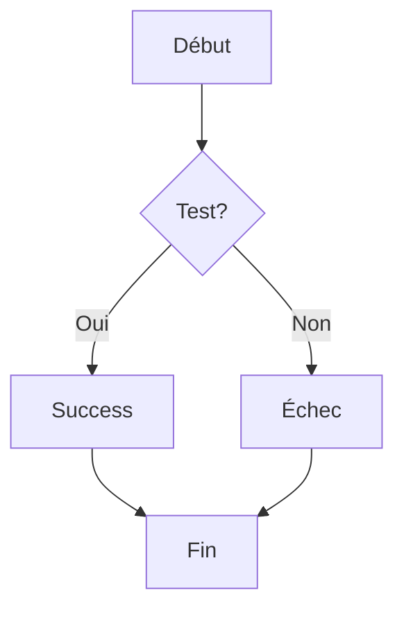
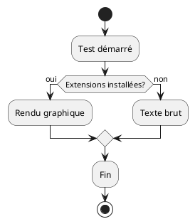

# 🧪 Test Rendu Diagrammes VS Code

## 📊 Test Mermaid (devrait être rendu graphiquement)

## 🎨 Test PlantUML (devrait être rendu graphiquement)

## ✅ Instructions de Test

1. **Ouvrir Preview Markdown** : `Ctrl+Shift+V` ou clic droit → "Open Preview"
2. **Vérifier Mermaid** : Le diagramme de flux doit apparaître en graphique
3. **Vérifier PlantUML** : Le diagramme de processus doit être visualisé
4. **Si texte brut** : Redémarrer VS Code pour activer les extensions

## 🔧 Dépannage

Si les diagrammes restent en texte :
- Redémarrez VS Code : `Ctrl+Shift+P` → "Developer: Reload Window"  
- Vérifiez les extensions : `Ctrl+Shift+X`
- Testez avec `Ctrl+Shift+V` sur ce fichier

---

*Test créé automatiquement - Extensions diagrammes installées*
