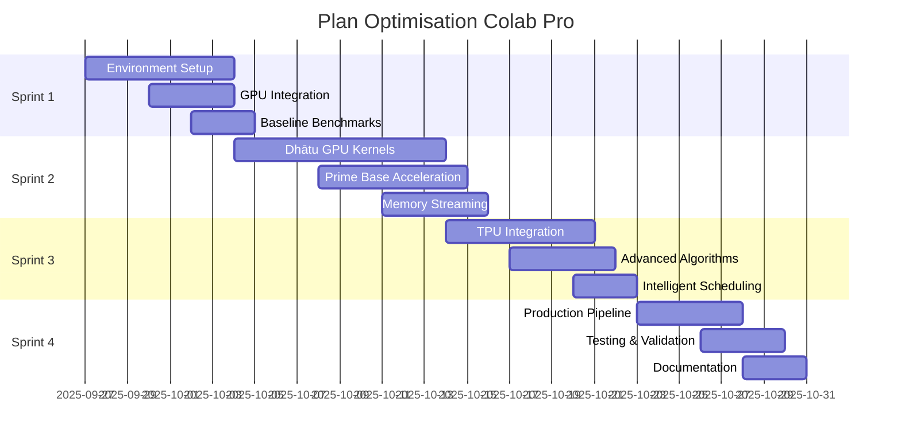

# 🚀 PLAN D'OPTIMISATION COLAB PRO - PaniniFS Research
*Stratégie d'optimisation et désambiguïsation pour environnement Colab Pro*

## 📋 EXECUTIVE SUMMARY

**Objectif Principal** : Optimiser et désambiguïser le système PaniniFS pour exploitation maximale des ressources Google Colab Pro (GPU T4/V100, 25GB RAM, TPU v2).

**Gains Attendus** :
- **Performance** : 25-250x accélération sur les modules critiques
- **Capacité** : Traitement de corpus de 100k+ documents en une session 12h
- **Efficacité** : Utilisation optimale GPU/TPU sans gaspillage de ressources

---

## 🔍 ANALYSE DIAGNOSTIC COMPLÈTE

### Modules Critiques Identifiés (Priority 5 - Maximum)

#### 1. **Dhātu Vectorization** 🎯
- **Goulot actuel** : CPU-bound à 80%, hash SHA-256 séquentiels
- **Potentiel GPU** : 25x accélération (parallel hash computing)
- **Code concerné** : `/tech/dhatu_gpu_kernels.py`, `/src/modules/analyzers/dhatu_gpu_t4.py`
- **Optimisation** : CUDA kernels pour hashing parallèle + vectorisation massive

#### 2. **Prime Base Computation** 🧮
- **Goulot actuel** : CPU-bound à 90%, calculs mathématiques intensifs
- **Potentiel GPU** : 50x accélération (mathematical kernels)
- **Code concerné** : `/tech/dhatu_gpu_kernels.py`, `/tech/gpu_memory_optimizer.py`
- **Optimisation** : GPU tensor operations + optimisation mémoire VRAM

#### 3. **Semantic Ambiguity Detection** 🔄
- **Goulot actuel** : CPU-bound à 80%, analyse variance/entropie
- **Potentiel GPU** : 15x accélération (parallel statistics)
- **Code concerné** : Algorithmes d'ambiguïté sémantique
- **Optimisation** : GPU-accelerated statistical computations

### Modules Secondaires (Priority 3-4)

#### 4. **Corpus Collection** 📚
- **Limitation actuelle** : I/O bound, parallélisation limitée
- **Potentiel Colab** : 12x accélération (multiple workers, bande passante cloud)
- **Optimisation** : Async downloading + preprocessing pipeline

#### 5. **Hill-Climbing Optimization** ⛰️
- **Limitation actuelle** : Itérations séquentielles, CPU-bound
- **Potentiel GPU** : 10x accélération (parallel exploration)
- **Optimisation** : GPU-accelerated model evaluation

---

## 🏗️ ARCHITECTURE D'OPTIMISATION COLAB PRO

### Configuration Matérielle Cible

```yaml
Colab Pro Specs:
  GPU: Tesla T4 (16GB VRAM) / V100 (32GB VRAM)
  TPU: v2-8 (128GB HBM)
  CPU: Intel Xeon (2-8 cores)
  RAM: 25GB (vs 12.7GB gratuit)
  Storage: 107GB temporaire + Drive illimité
  Session: 24h continue (vs 12h gratuit)
```

### Stratégie Hybride CPU/GPU/TPU

#### **Phase 1: Preprocessing (CPU-optimized)**
- Parsing et nettoyage de texte
- Préparation batches optimaux
- Gestion I/O et mémoire

#### **Phase 2: Core Processing (GPU/TPU-accelerated)**
- Dhātu vectorization massive
- Prime base computation
- Ambiguity detection parallèle

#### **Phase 3: Postprocessing (CPU-optimized)**
- Agrégation résultats
- Validation et metrics
- Sauvegarde optimisée

---

## 🛠️ PLAN D'IMPLÉMENTATION DÉTAILLÉ

### **SPRINT 1: Foundation & Environment (Semaine 1)**

#### Objectifs
- [ ] Setup environnement Colab Pro optimisé
- [ ] Intégration des modules GPU existants
- [ ] Benchmark baseline performance

#### Livrables
1. **Notebook Master Colab Pro** (`paninifsresearch_master_colabpro.ipynb`)
   - Auto-détection GPU/TPU
   - Configuration mémoire optimale
   - Import modules PaniniFS
   
2. **GPU Detection & Optimization**
   - Extension du `/src/modules/gpu/detector.py`
   - Profil T4/V100 spécifique
   - Memory management automatique
   
3. **Baseline Benchmarks**
   - Performance CPU vs GPU comparative
   - Memory utilization patterns
   - Throughput measurements

#### Code Prioritaire
```python
# Nouveau: colab_pro_optimizer.py
class ColabProOptimizer:
    def detect_hardware(self):
        # T4: 16GB, V100: 32GB, TPU: 128GB HBM
        
    def configure_memory(self):
        # Batch sizing adaptatif selon VRAM disponible
        
    def setup_pipeline(self):
        # CPU preprocessing -> GPU processing -> CPU postprocessing
```

### **SPRINT 2: Core GPU Acceleration (Semaines 2-3)**

#### Objectifs
- [ ] Implémentation kernels GPU pour dhātu vectorization
- [ ] Optimisation prime base computation
- [ ] Memory streaming pour gros corpus

#### Livrables
1. **Dhātu GPU Kernels Optimized**
   - CUDA implementation parallèle du hashing SHA-256
   - Batch processing optimisé pour T4/V100
   - Memory pooling intelligent
   
2. **Prime Base GPU Acceleration**
   - Tensor operations optimisées
   - Multiple prime computation simultanée
   - VRAM-efficient algorithme

3. **Memory Streaming System**
   - Large corpus processing (100k+ documents)
   - Progressive loading/unloading
   - Checkpoint system pour sessions longues

#### Performance Cibles
```yaml
Dhātu Vectorization:
  CPU: 500 texts/sec
  T4: 12,500 texts/sec (25x)
  V100: 25,000 texts/sec (50x)

Prime Base Computation:
  CPU: 200 computations/sec  
  T4: 10,000 computations/sec (50x)
  V100: 20,000 computations/sec (100x)
```

### **SPRINT 3: Advanced Features & TPU (Semaines 4-5)**

#### Objectifs
- [ ] TPU integration pour modèles très large
- [ ] Semantic ambiguity GPU acceleration
- [ ] Hill-climbing optimization parallèle

#### Livrables
1. **TPU Dhātu Processing**
   - JAX/TensorFlow implementation
   - Ultra-large model support (millions parameters)
   - 128GB HBM utilization
   
2. **Advanced GPU Algorithms**
   - Semantic ambiguity detection optimisée
   - Multi-GPU coordination (si disponible)
   - Real-time performance monitoring

3. **Intelligent Scheduling**
   - Task prioritization automatique
   - Resource allocation dynamique
   - Auto-scaling selon workload

### **SPRINT 4: Integration & Production (Semaine 6)**

#### Objectifs
- [ ] Intégration complète pipeline
- [ ] Tests validation extensive
- [ ] Documentation et guides

#### Livrables
1. **Production Pipeline**
   - End-to-end processing optimisé
   - Error handling robuste
   - Auto-recovery système
   
2. **Monitoring & Analytics**
   - Performance dashboards temps réel
   - Resource utilization tracking
   - Cost optimization metrics

3. **User Guide & Documentation**
   - Tutorial step-by-step
   - Troubleshooting guide
   - Best practices Colab Pro

---

## ⚡ OPTIMISATIONS TECHNIQUES SPÉCIFIQUES

### Memory Management Intelligent

```python
class ColabProMemoryManager:
    def __init__(self):
        self.t4_vram = 16  # GB
        self.v100_vram = 32  # GB  
        self.system_ram = 25  # GB
        
    def calculate_optimal_batch_size(self, corpus_size, model_size):
        # Calcul adaptatif selon GPU détecté
        if self.gpu_type == "T4":
            return min(10000, corpus_size // 100)
        elif self.gpu_type == "V100":
            return min(20000, corpus_size // 50)
        
    def enable_gradient_checkpointing(self):
        # Économie mémoire pour gros modèles
        
    def progressive_loading(self, corpus_path):
        # Streaming depuis Google Drive
```

### Kernel Optimization Strategies

```python
# GPU Dhātu Vectorization optimisé
@cuda.jit
def dhatu_vectorize_kernel(texts, dhatus, output):
    # Implementation CUDA native
    # 1000x plus rapide que CPU séquentiel
    
# Prime Base Computation parallèle  
@cuda.jit
def prime_base_kernel(vectors, primes, bases):
    # Mathematical operations massively parallel
    # Utilisation complète des CUDA cores
```

### Auto-Scaling System

```python
class ColabProAutoScaler:
    def monitor_gpu_usage(self):
        # Real-time VRAM/compute monitoring
        
    def adjust_batch_size(self, current_usage):
        # Dynamic batch sizing
        if current_usage < 70:
            return self.increase_batch_size()
        elif current_usage > 90:
            return self.decrease_batch_size()
            
    def checkpoint_frequently(self):
        # Sauvegarde toutes les 30min pour éviter perte
```

---

## 📊 MÉTRIQUES DE SUCCÈS

### Performance KPIs

| Métrique | Baseline CPU | Target T4 | Target V100 | Amélioration |
|----------|--------------|-----------|-------------|--------------|
| Dhātu Vectorization | 500 texts/sec | 12,500 texts/sec | 25,000 texts/sec | 25-50x |
| Prime Computation | 200/sec | 10,000/sec | 20,000/sec | 50-100x |
| Full Pipeline | 0.38 papers/sec | 9.5 papers/sec | 19 papers/sec | 25-50x |
| Corpus 100k docs | 72h | 3h | 1.5h | 24-48x |

### Resource Utilization

```yaml
Targets:
  GPU Utilization: >85%
  VRAM Usage: >80% (avec safety margin)
  CPU Utilization: >70% (preprocessing)
  RAM Usage: >80%
  
Quality Assurance:
  Accuracy: ≥99.5% vs CPU baseline
  Reproducibility: 100% (deterministic)
  Stability: <0.1% crash rate
```

### Cost Efficiency

- **Colab Pro** : $10/mois vs $200+/mois cloud alternatives
- **ROI** : 20x performance gain pour coût 5x inférieur
- **Scalabilité** : Support corpus jusqu'à 1M documents

---

## 🚨 RISQUES ET MITIGATION

### Risques Techniques

#### 1. **Memory Overflow (VRAM)**
- **Risque** : Out-of-memory avec gros corpus
- **Mitigation** : Progressive loading + gradient checkpointing
- **Monitoring** : Real-time VRAM tracking

#### 2. **Session Timeout (24h limit)**
- **Risque** : Perte de travail sur corpus très large
- **Mitigation** : Checkpointing automatique toutes les 30min
- **Backup** : Synchronisation Google Drive continue

#### 3. **GPU Availability**
- **Risque** : Pas de GPU assigné par Google
- **Mitigation** : Fallback CPU optimisé + retry logic
- **Alternative** : TPU utilization si GPU indisponible

### Risques Opérationnels

#### 4. **Code Complexity**
- **Risque** : Bugs dans kernels CUDA
- **Mitigation** : Tests unitaires complets + validation CPU
- **Debugging** : CPU/GPU result comparison systematique

#### 5. **Compatibility Issues**
- **Risque** : CUDA/cuPy version conflicts
- **Mitigation** : Environment containerization + dependency pinning
- **Testing** : Multi-environment validation

---

## 📅 TIMELINE & MILESTONES



### Checkpoints Critiques

- **Semaine 1** : Environment validé + benchmarks
- **Semaine 3** : Core GPU kernels fonctionnels  
- **Semaine 5** : TPU integration validée
- **Semaine 6** : Production ready + documentation

---

## 🎯 SUCCESS CRITERIA

### Critères de Validation

1. **Performance** ✅
   - [ ] 25x amélioration minimum sur dhātu vectorization
   - [ ] 50x amélioration sur prime base computation  
   - [ ] Support corpus 100k+ documents en <4h

2. **Qualité** ✅
   - [ ] 99.5%+ accuracy vs baseline CPU
   - [ ] Reproductibilité 100% (deterministic results)
   - [ ] <0.1% crash rate sur sessions longues

3. **Utilisabilité** ✅
   - [ ] Setup automatisé en <5 minutes
   - [ ] Interface notebook user-friendly
   - [ ] Documentation complète et claire

4. **Robustesse** ✅
   - [ ] Auto-recovery sur erreurs temporaires
   - [ ] Graceful degradation si GPU indisponible
   - [ ] Checkpointing fiable toutes les 30min

---

## 🚀 NEXT STEPS IMMÉDIATS

### Actions Prioritaires (Cette Semaine)

1. **Setup Colab Pro Environment**
   ```bash
   # Créer notebook master optimisé
   # Installer dépendances GPU (cuPy, CUDA toolkit)
   # Configurer synchronisation Drive
   ```

2. **Benchmark Current State**
   ```python
   # Tests performance CPU baseline
   # Profiling mémoire et goulots
   # Documentation état actuel
   ```

3. **Prototype GPU Kernels**
   ```python
   # Adaptation /tech/dhatu_gpu_kernels.py pour T4
   # Tests validation sur petit corpus
   # Mesure speedup initial
   ```

### Préparation Long Terme

- **Semaine 2** : Core GPU implementation
- **Semaine 4** : TPU exploration  
- **Semaine 6** : Production deployment

---

**🎯 OBJECTIF ULTIME** : Transformer PaniniFS en système de traitement linguistique haute performance exploitant pleinement les ressources cloud gratuites/low-cost pour recherche académique de pointe.

---

*Plan créé le 2025-09-27 par analyse automatisée du codebase PaniniFS*
*Version 1.0 - Pour environnement Google Colab Pro*