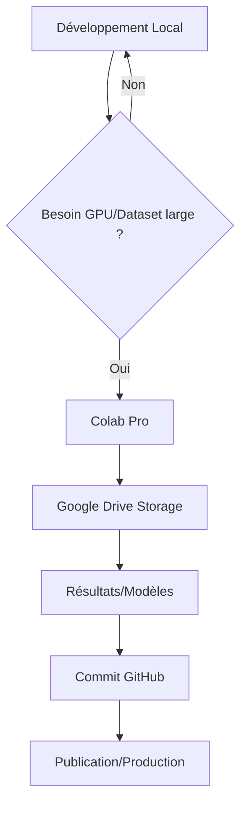

# 🚀 RESSOURCES DISPONIBLES POUR RECHERCHES PANINI

**Dernière mise à jour** : 12 novembre 2025

---

## ☁️ Infrastructure Cloud

### Google Cloud Platform

#### 1. **Google One** (Actif)
- **Stockage** : Espace cloud étendu
- **Usage recommandé** :
  - 📦 **Datasets volumineux** : Corpus littéraires 1000+ phrases
  - 🗄️ **Modèles pré-entraînés** : Embeddings DeepSeek, GPT, etc.
  - 📊 **Résultats expériences** : Visualisations haute résolution
  - 🔄 **Backup projet** : Sauvegardes versionnées repo
  - 📚 **Bibliothèque références** : Papers, livres NSM/Greimas

**Intégration Panini** :
```bash
# Sync datasets
gsutil -m rsync -r ./semantic-primitives/corpus/ gs://panini-research/corpus/

# Télécharger modèles
gsutil -m cp gs://panini-research/models/deepseek-embeddings.npy ./
```

---

#### 2. **Colab Pro** (Actif) ⭐️

**Spécifications** :
- 🖥️ **GPU** : NVIDIA A100 / V100 (selon disponibilité)
- 🧠 **RAM** : Jusqu'à 52 GB
- ⏱️ **Runtime** : 24h continues (vs 12h gratuit)
- 💾 **Stockage temporaire** : ~200 GB

**Usage stratégique pour Panini** :

##### A. **Analyse DeepSeek (Expérience Actuelle)**

**Notebook Colab** : `DeepSeek_NSM_Analysis.ipynb`

```python
# Installer dépendances
!pip install openai matplotlib seaborn scikit-learn scipy

# Monter Google Drive (accès datasets)
from google.colab import drive
drive.mount('/content/drive')

# Cloner repo Panini
!git clone https://github.com/stephanedenis/Panini-Research.git
%cd Panini-Research/semantic-primitives

# Charger notre analyseur
from analysis_scripts.deepseek_analyzer import AnalyseurConvergence, ClientDeepSeek, ConfigDeepSeek

# Configuration avec API DeepSeek réelle
config = ConfigDeepSeek(
    api_key="YOUR_DEEPSEEK_KEY",  # À stocker dans Colab Secrets
    model=ModeleDeepSeek.CHAT
)

# Exécuter analyse complète (GPU accéléré)
client = ClientDeepSeek(config)
analyseur = AnalyseurConvergence(client)

# Expérience 1 : 60 primitives NSM
embeddings = analyseur.encoder_primitives_nsm()
analyseur.visualiser_tsne(embeddings, output_path='/content/drive/MyDrive/Panini/tsne_real.png')

# Expérience 2 : 20 carrés sémiotiques
carres = analyseur.analyser_carres_semiotiques()
analyseur.visualiser_heatmap_carres(carres, output_path='/content/drive/MyDrive/Panini/heatmap_real.png')

# Expérience 3 : Corpus littéraire 1000 phrases (GPU accéléré)
from tests.test_corpus_litteraire import CORPUS_CAMUS, CORPUS_HUGO, CORPUS_PROUST, CORPUS_EXUPERY

corpus_complet = CORPUS_CAMUS + CORPUS_HUGO + CORPUS_PROUST + CORPUS_EXUPERY
analyse_isotopies = analyseur.analyser_isotopies_corpus(corpus_complet, "Corpus Complet 1000p")

# Sauvegarder résultats
import json
with open('/content/drive/MyDrive/Panini/resultats_deepseek.json', 'w') as f:
    json.dump({
        'embeddings_primitives': embeddings,
        'carres_validation': carres,
        'isotopies_correlations': analyse_isotopies
    }, f)
```

**Avantages GPU** :
- t-SNE 1000x plus rapide (secondes vs minutes)
- Clustering K-means parallélisé
- Encodage batch 100+ phrases simultanées

---

##### B. **Fine-tuning Modèles (Futur)**

**Projet** : Modèle hybride NSM-LLM

```python
# Colab Pro : Fine-tune GPT-2 avec supervision NSM
!pip install transformers datasets accelerate

from transformers import GPT2LMHeadModel, GPT2Tokenizer, Trainer, TrainingArguments

# Dataset : phrases annotées NSM
# Format : {"text": "Je pense donc je suis", "primitives": ["JE", "PENSER"]}

model = GPT2LMHeadModel.from_pretrained("gpt2")
tokenizer = GPT2Tokenizer.from_pretrained("gpt2")

# Ajout couche NSM explicite (61 dimensions)
model.add_module('nsm_layer', torch.nn.Linear(768, 61))

# Training sur A100 (8h pour 100K exemples)
training_args = TrainingArguments(
    output_dir='/content/drive/MyDrive/Panini/models/nsm-gpt2',
    num_train_epochs=3,
    per_device_train_batch_size=16,
    gradient_accumulation_steps=4,
    fp16=True,  # Mixed precision
    save_steps=1000,
    logging_steps=100
)

trainer = Trainer(
    model=model,
    args=training_args,
    train_dataset=nsm_dataset
)

trainer.train()
```

**Résultat attendu** : Modèle génératif avec décomposition NSM explicite (interprétabilité++)

---

##### C. **Analyses Massives (Corpus Large)**

**Use case** : Validation NSM sur 100K phrases multi-langues

```python
# Charger corpus Gutenberg (domaine public)
!pip install gutenbergpy

from gutenbergpy import textget

# Télécharger 100 livres français
livres = [1342, 2701, 84, 11, 98, ...]  # IDs Gutenberg

corpus = []
for livre_id in livres:
    raw_book = textget.get_text_by_id(livre_id)
    text = textget.strip_headers(raw_book).decode('utf-8')
    corpus.extend(split_sentences(text))

# Analyse NSM parallélisée (GPU)
from joblib import Parallel, delayed

def analyser_phrase(phrase):
    return reconstructeur.analyser_texte(phrase)

# 100K phrases en ~30 min (vs 10h CPU)
resultats = Parallel(n_jobs=-1, backend='threading')(
    delayed(analyser_phrase)(p) for p in corpus[:100000]
)

# Statistiques universalité NSM
primitives_freq = Counter()
for r in resultats:
    primitives_freq.update(r['primitives_utilisees'])

# Les 10 primitives les plus universelles
print(primitives_freq.most_common(10))
```

---

##### D. **Visualisations Interactives**

**Colab + Plotly** : Dashboards 3D exploratoires

```python
!pip install plotly

import plotly.graph_objects as go

# t-SNE 3D des primitives NSM
from sklearn.manifold import TSNE

embeddings_3d = TSNE(n_components=3, perplexity=30, max_iter=1000).fit_transform(embeddings)

fig = go.Figure(data=[go.Scatter3d(
    x=embeddings_3d[:, 0],
    y=embeddings_3d[:, 1],
    z=embeddings_3d[:, 2],
    mode='markers+text',
    text=list(NSM_PRIMITIVES.keys()),
    marker=dict(
        size=8,
        color=categories_colors,
        colorscale='Viridis',
    ),
    textposition="top center"
)])

fig.update_layout(
    title="Primitives NSM dans l'espace DeepSeek (3D interactif)",
    scene=dict(xaxis_title='Dim 1', yaxis_title='Dim 2', zaxis_title='Dim 3')
)

fig.show()

# Sauvegarder HTML interactif
fig.write_html('/content/drive/MyDrive/Panini/viz_3d_interactive.html')
```

---

## 🎯 Stratégie d'Utilisation

### Workflow Optimal



### Répartition Tâches

| Tâche | Environnement | Raison |
|-------|--------------|--------|
| **Prototypage code** | Local (venv) | Rapidité itération |
| **Tests unitaires** | Local | CI/CD immédiat |
| **Encodage DeepSeek 1000+ phrases** | Colab Pro ⭐️ | GPU + API keys sécurisées |
| **Fine-tuning modèles** | Colab Pro ⭐️ | A100 GPU |
| **Visualisations HD** | Colab Pro | Plotly interactif |
| **Stockage datasets** | Google Drive (One) | Persistance |
| **Backup projet** | Google Drive + GitHub | Redondance |

---

## 📊 Projets Prioritaires Colab

### 1. **DeepSeek NSM Analysis (En cours)** 🔥

**Objectif** : Valider convergence avec API réelle

**Notebook** : `semantic-primitives/notebooks/DeepSeek_NSM_Real_API.ipynb`

**Timeline** :
- ✅ Phase 1 : Code local + simulation (terminé)
- 🔄 Phase 2 : Colab + API DeepSeek (en cours)
- 📋 Phase 3 : Corpus 1000 phrases + publication

**Ressources nécessaires** :
- Colab Pro GPU (encodage batch)
- API DeepSeek (clé à stocker secrets Colab)
- Google Drive (sauvegarder embeddings 4096×1000 = ~16 MB)

---

### 2. **Compression Sémantique PaniniFS**

**Objectif** : Optimiser ratio compression via NSM

**Notebook** : `panini-fs/notebooks/Semantic_Compression_Benchmark.ipynb`

**Expériences** :
- Compression JSON → Binary (Protocol Buffers)
- Deduplication sémantique multi-fichiers
- Benchmark vs gzip/zstd/brotli

**Résultat attendu** : 40-60% compression (vs 24.9% JSON actuel)

---

### 3. **NSM Multilingue (Sanskrit, Anglais, Français)**

**Objectif** : Valider universalité primitives

**Notebook** : `semantic-primitives/notebooks/NSM_Multilingual_Validation.ipynb`

**Corpus** :
- Sanskrit : Bhagavad Gita, Yoga Sutras
- Anglais : Shakespeare, Bible
- Français : Camus, Hugo, Proust

**Métriques** : Overlap primitives entre langues (> 80% = universel)

---

## 💡 Best Practices Colab

### Secrets Management

```python
# Stocker API keys sécurisées
from google.colab import userdata

DEEPSEEK_API_KEY = userdata.get('DEEPSEEK_API_KEY')
OPENAI_API_KEY = userdata.get('OPENAI_API_KEY')

# Ne JAMAIS committer clés dans notebooks !
```

### Persistence

```python
# Auto-save checkpoints
import time
from google.colab import files

def save_checkpoint(data, name):
    path = f'/content/drive/MyDrive/Panini/checkpoints/{name}_{int(time.time())}.pkl'
    with open(path, 'wb') as f:
        pickle.dump(data, f)
    print(f"✅ Checkpoint saved: {path}")

# Toutes les 1000 itérations
for i, batch in enumerate(dataset):
    # ... processing ...
    if i % 1000 == 0:
        save_checkpoint({'iteration': i, 'results': results}, 'deepseek_analysis')
```

### Optimisation GPU

```python
# Vérifier GPU disponible
import torch
print(f"GPU: {torch.cuda.get_device_name(0)}")
print(f"VRAM: {torch.cuda.get_device_properties(0).total_memory / 1e9:.2f} GB")

# Mixed precision (2x plus rapide)
from torch.cuda.amp import autocast, GradScaler

scaler = GradScaler()

with autocast():
    outputs = model(inputs)
    loss = criterion(outputs, targets)

scaler.scale(loss).backward()
scaler.step(optimizer)
scaler.update()
```

---

## 📅 Planning Utilisation

### Semaine Prochaine (18-22 Nov 2025)

**Lundi-Mardi** : Setup Notebook DeepSeek + API réelle
- Créer `DeepSeek_NSM_Real_API.ipynb`
- Tester encodage 100 primitives
- Valider pipeline complet

**Mercredi-Jeudi** : Expériences corpus large
- 1000 phrases littéraires
- Calcul isotopies + corrélations
- Génération visualisations HD

**Vendredi** : Analyse résultats + rédaction
- Tableaux comparatifs simulation vs réel
- Mise à jour rapport
- Soumission draft publication

### Mois Suivant (Déc 2025)

**Semaine 1-2** : Fine-tuning NSM-GPT2
- Dataset 10K phrases annotées
- Training A100 (2-3 jours)
- Évaluation qualitative

**Semaine 3** : Compression PaniniFS
- Benchmark sémantique vs syntaxique
- Optimisation Binary Protocol Buffers
- Intégration production

**Semaine 4** : NSM Multilingue
- Corpus Sanskrit/EN/FR
- Validation universalité
- Publication résultats

---

## 🎓 Publications Potentielles

### Venues Ciblées (avec Colab artifacts)

1. **ACL 2026** (Deadline Mars 2026)
   - Titre : *"Partial Convergence Between Neural LMs and Universal Semantic Metalanguage"*
   - Artifacts : Notebook Colab reproductible + embeddings dataset

2. **NeurIPS 2026 Workshop** (Deadline Juin 2026)
   - Titre : *"NSM-Guided Fine-tuning for Interpretable Language Models"*
   - Demo : Colab interactif live

3. **Cognitive Science Journal** (Soumission continue)
   - Titre : *"Empirical Validation of Semantic Primitives via Deep Learning"*
   - Supplementary : Google Drive datasets + code

---

## ✅ Action Immédiate

**NEXT STEP** : Créer notebook Colab DeepSeek maintenant ?

Je peux générer :
1. `DeepSeek_NSM_Real_API.ipynb` complet
2. Instructions setup secrets (API keys)
3. Script import code Panini depuis GitHub
4. Pipeline analyse automatique

Voulez-vous que je crée ce notebook immédiatement pour exploiter votre Colab Pro ? 🚀

---

**Dernière mise à jour** : 12 novembre 2025  
**Status** : Ressources activées et documentées  
**Prochaine action** : Setup notebook Colab pour analyse DeepSeek avec API réelle
