# Schémas (PlantUML via Kroki)

Ce projet rend les schémas à partir de diagram-as-code en SVG, avec hyperliens cliquables.

Exemple PlantUML avec liens:

```plantuml
@startuml
skinparam linetype ortho
skinparam defaultFontName Roboto
skinparam ArrowColor #1976D2
skinparam RectangleFontStyle bold

rectangle "[[https://paninifs.org Accueil]]" as Home #lightblue
rectangle "[[https://github.com/stephanedenis/PaniniFS Repo]]" as Repo #lightgreen
rectangle "[[/specs/execution-orchestrator/ Orchestrateur]]" as Orchestrator #lightyellow

Home --> Repo : code
Home --> Orchestrator : specs
Repo --> Orchestrator : submodule
@enduml
```

Notes:
- Les liens PlantUML `[[url label]]` sont transformés en liens SVG.
- Mermaid est aussi supporté via superfences.
