# Diagrams (PlantUML via Kroki)

This site renders diagrams-as-code to SVG with clickable hyperlinks.

PlantUML example with links:

```plantuml
@startuml
skinparam linetype ortho
skinparam defaultFontName Roboto
skinparam ArrowColor #1976D2
skinparam RectangleFontStyle bold

rectangle "[[https://paninifs.org Home]]" as Home #lightblue
rectangle "[[https://github.com/stephanedenis/PaniniFS Repo]]" as Repo #lightgreen
rectangle "[[/en/specs/execution-orchestrator/ Orchestrator]]" as Orchestrator #lightyellow

Home --> Repo : code
Home --> Orchestrator : specs
Repo --> Orchestrator : submodule
@enduml
```

Notes:
- PlantUML `[[url label]]` links become SVG links.
- Mermaid is also supported via superfences.